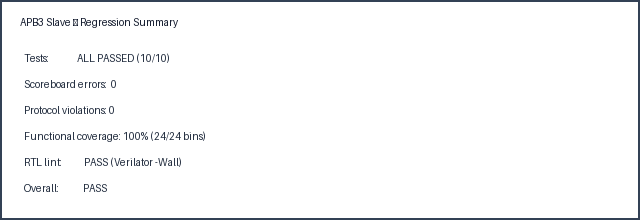
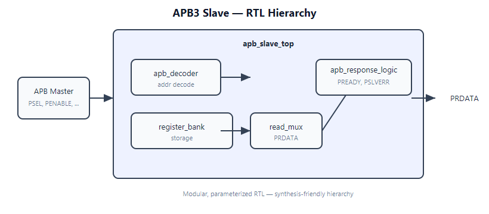
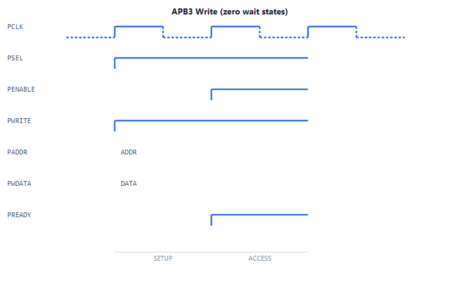
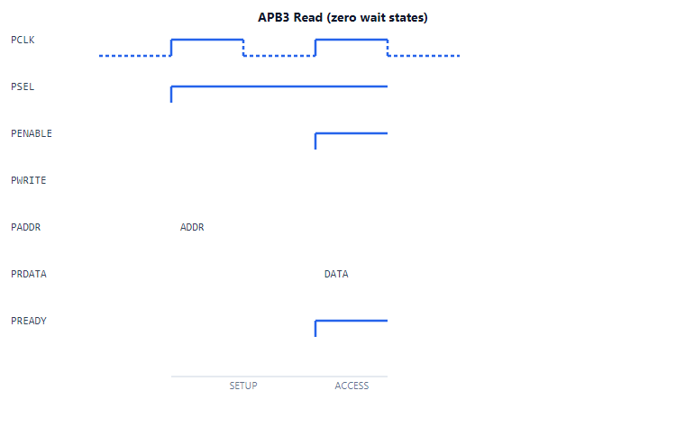
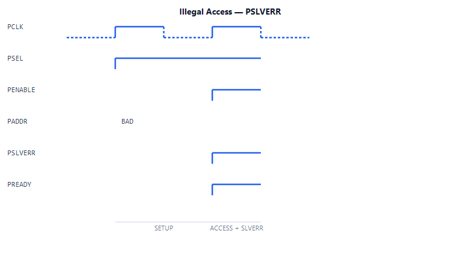
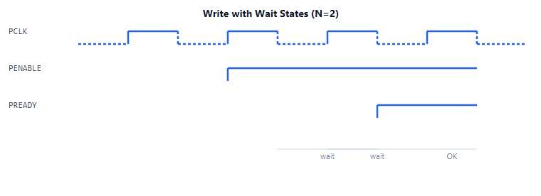
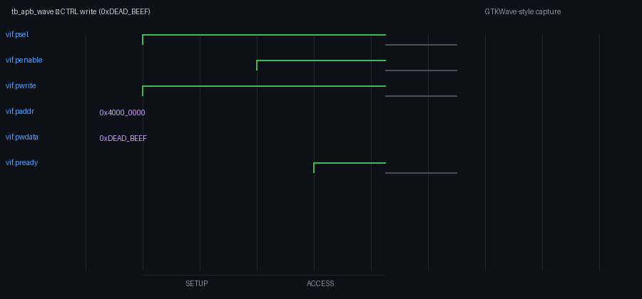

# APB3 Slave Peripheral IP

[](https://github.com/GSriVishnuVardhan/APB_SLAVE/actions/workflows/ci.yml)

Production-style **AMBA APB3 slave** with parameterized register bank, modular RTL hierarchy, and a complete **UVM-lite** verification environment (driver, monitor, scoreboard, reference model, coverage, assertions).
Built as a portfolio IP block for freelance RTL/verification work.

---

## Overview

### What is APB?

The **Advanced Peripheral Bus (APB)** is ARM's low-complexity, low-power bus for connecting peripherals (UART, timers, GPIO, control registers) to a system interconnect. APB3 uses a **two-phase transfer**: **SETUP** (`PSEL=1`, `PENABLE=0`) then **ACCESS** (`PSEL=1`, `PENABLE=1`). The slave completes the beat by asserting **`PREADY`**.

This IP implements a **memory-mapped 32-bit register slave** with configurable wait states and optional protocol FSM.

### Features

| Feature | Description |
|---------|-------------|
| **APB3 compliant** | SETUP / ACCESS sequencing, `PREADY` wait states, `PSLVERR` |
| **Parameterized** | Data width, base address, register counts, max wait cycles |
| **Register bank** | 4 control + 16 user registers (20 total) |
| **Error response** | Illegal address, unaligned access, STATUS write → `PSLVERR` |
| **Optional FSM** | `USE_APB_FSM` for IDLE/SETUP/ACCESS tracking + live STATUS |
| **Verified** | 10 tests, 100% functional coverage, 0 scoreboard errors |
| **Lint-clean RTL** | Verilator `--lint-only -Wall` — 0 errors, 0 warnings |
| **Synthesis-ready** | Yosys open-source flow — `make synth` |

### Verification status

| Metric | Result |
|--------|--------|
| RTL lint (Verilator) | **PASS** — 0 errors, 0 warnings |
| Yosys synthesis | **PASS** — 2187 cells, 611 FFs, 0 check errors |
| Directed tests | **10 / 10 PASS** |
| Scoreboard errors | **0** |
| Protocol violations | **0** |
| Functional coverage | **100%** (24/24 bins) |

Details: [`docs/VERIFICATION_RESULTS.md`](docs/VERIFICATION_RESULTS.md)



---
## Block diagram



SVG source: [`docs/images/apb_block_diagram.svg`](docs/images/apb_block_diagram.svg)

### RTL hierarchy
| Module | File | Function |
|--------|------|----------|
| `apb_slave_top` | `rtl/apb_slave_top.sv` | Top-level integration |
| `apb_decoder` | `rtl/apb_decoder.sv` | Address decode, `reg_sel`, legality |
| `register_bank` | `rtl/register_bank.sv` | Register storage + write strobes |
| `read_mux` | `rtl/read_mux.sv` | Read data multiplexing |
| `apb_response_logic` | `rtl/apb_response_logic.sv` | `PREADY`, `PSLVERR`, wait states, optional FSM |

---

## Register map

Base address: **`0x4000_0000`** (parameter `SLAVE_BASE_ADDR`)

| Offset | Name | Access | Description |
|--------|------|--------|-------------|
| `0x00` | CTRL | RW | bit0 Enable, bit1 Interrupt Enable |
| `0x04` | STATUS | RO | bit0 Busy, bit1 Error (live when `USE_APB_FSM=1`) |
| `0x08` | CONFIG0 | RW | Configuration word 0 |
| `0x0C` | CONFIG1 | RW | Configuration word 1 |
| `0x10`–`0x4C` | USER[0:15] | RW | User-defined registers |

**Rules:** word-aligned only; offsets `0x50`–`0xFF` in the 256 B slot → `PSLVERR`; STATUS write → `PSLVERR`.

Full spec: [`docs/register_map.txt`](docs/register_map.txt)

---

## Timing diagrams

| Write (zero wait) | Read (zero wait) |
|-------------------|------------------|
|  |  |

| SLVERR (illegal access) | Wait states (N=2) |
|-------------------------|-------------------|
|  |  |

With wait states (`num_wait_cycles = N`), `PREADY` stays low for **N** ACCESS cycles, then asserts high for **one** completion cycle.

More detail: [`docs/VERIFICATION_RESULTS.md`](docs/VERIFICATION_RESULTS.md)

---
## Directory structure

```
APB_SLAVE/
├── LICENSE
├── README.md
├── rtl/                    Synthesizable design
│   ├── apb_slave_top.sv
│   ├── apb_decoder.sv
│   ├── register_bank.sv
│   ├── read_mux.sv
│   └── apb_response_logic.sv
├── tb/                     UVM-lite verification IP
│   ├── tb_apb_slave.sv     Test top + 10 directed tests
│   ├── apb_if.sv           Virtual interface
│   ├── apb_transaction.sv
│   ├── apb_driver.sv       Stimulus
│   ├── apb_monitor.sv      Monitor → mailboxes
│   ├── apb_ref_model.sv    Golden reference model
│   ├── apb_scoreboard.sv   DUT vs ref model
│   ├── apb_coverage.sv     Functional coverage
│   ├── apb_protocol_checker.sv   Verilator checks
│   └── apb_assertions.sv   SVA (Questa/Xcelium)
├── sim/
│   ├── Makefile            make sim | lint | wave
│   ├── run_sim.sh          Verilator regression
│   ├── lint.sh             RTL lint-only
│   └── filelist.f
├── docs/                   Specs + integration + results
│   └── images/             Block diagram + timing diagrams
└── reports/                Regression + coverage artifacts
```

Architecture: [`docs/VERIFICATION_ARCHITECTURE.md`](docs/VERIFICATION_ARCHITECTURE.md)

---

## Simulation

### Verilator (primary — tested)

MSYS2 MINGW64:

```bash
cd sim
make sim          # or: ./run_sim.sh
make lint         # RTL lint-only
make wave         # short traced sim → reports/wave/apb_wave.fst
make synth        # Yosys open-source synthesis
```

Open FST in GTKWave:

```bash
# One-time: pacman -S mingw-w64-x86_64-gtkwave  (then new MINGW64 shell)
cd sim
make wave-view
```

Or manually: `cd reports/wave && gtkwave apb_wave.fst apb_wave.tcl`

Do not use `apb_wave.gtkw` — use the Tcl helper or FST directly.



More wave captures: [`docs/VERIFICATION_RESULTS.md`](docs/VERIFICATION_RESULTS.md)

### RTL lint

Lint is run on synthesizable RTL only (`apb_slave_top` and submodules), via `sim/lint.sh`:

```bash
verilator --lint-only -Wall -Wno-fatal --sv --top-module apb_slave_top rtl/*.sv
```

**Last run:** 2026-06-27 — PASS (Verilator 5.046) — no inferred latches, unused signals, or synthesis warnings reported.

Re-check after RTL changes: `cd sim && make lint`

### Other simulators

| Tool | Command |
|------|---------|
| **Make** | `cd sim && make sim` |
| **Questa** | `vlog -sv -f filelist.f ../tb/apb_assertions.sv` then `vsim tb_apb_slave` |
| **Xcelium** | `xrun -sv -top tb_apb_slave -f filelist.f ../tb/apb_assertions.sv` |
| **Icarus** | Not supported (TB uses SV mailboxes + timing) |

Requirements: **Verilator 5.x** with `--timing --binary --sv`

### Open-source synthesis (Yosys)

```bash
cd sim
make synth
```

**Generic logic synthesis only** — no foundry/FPGA library loaded. See [Generic vs technology mapping](docs/SYNTHESIS_RESULTS.md#generic-vs-technology-mapping).

Reports: [`reports/synth/synth_summary.txt`](reports/synth/synth_summary.txt) (readable) · [`reports/synth/synth_report.txt`](reports/synth/synth_report.txt) (full log) · Details: [`docs/SYNTHESIS_RESULTS.md`](docs/SYNTHESIS_RESULTS.md)
| Check | Tool |
|-------|------|
| RTL lint | Verilator `--lint-only -Wall` |
| Simulation | Verilator regression (10 tests) |
| Waveform | Verilator FST + GTKWave |
| Synthesis | Yosys `proc → techmap → stat` |

---

## Verification environment

| Component | Present |
|-----------|---------|
| Driver | ✅ `apb_driver.sv` |
| Monitor | ✅ `apb_monitor.sv` |
| Scoreboard | ✅ `apb_scoreboard.sv` |
| Reference model | ✅ `apb_ref_model.sv` |
| Functional coverage | ✅ `apb_coverage.sv` |
| Assertions | ✅ `apb_protocol_checker.sv` + `apb_assertions.sv` |

---

## Integration snippet

```systemverilog
apb_slave_top #(
    .USE_APB_FSM       (1'b0),
    .SLAVE_BASE_ADDR   (32'h4000_0000),
    .MAX_WAIT_CYCLES   (7)
) u_apb_slave (
    .clk               (pclk),
    .rst_n             (presetn),
    .psel              (psel),
    .penable           (penable),
    .pwrite            (pwrite),
    .paddr             (paddr),
    .pwdata            (pwdata),
    .num_wait_cycles   (3'd2),
    .pready            (pready),
    .pslverr           (pslverr),
    .prdata            (prdata)
);
```

Full guide: [`docs/INTEGRATION.md`](docs/INTEGRATION.md)

---

## Documentation index

| Document | Content |
|----------|---------|
| [Design spec](docs/design_spec.txt) | RTL behavior, parameters |
| [Verification spec](docs/verification_spec.txt) | Test plan, coverage goals |
| [Register map](docs/register_map.txt) | Offsets and fields |
| [Integration](docs/INTEGRATION.md) | Ports, file list, instantiation |
| [Verification architecture](docs/VERIFICATION_ARCHITECTURE.md) | TB block diagram |
| [Verification results](docs/VERIFICATION_RESULTS.md) | Coverage, waveforms, reports |
| [Synthesis results](docs/SYNTHESIS_RESULTS.md) | Yosys flow + cell statistics |
| [Client one-pager](docs/CLIENT_ONE_PAGER.md) | Freelance / proposal summary |
| [FPGA roadmap](docs/FPGA_ROADMAP.md) | Future Vivado demo (Level 5) |
| [Spec compliance](docs/SPEC_COMPLIANCE.md) | RTL/TB vs spec audit |

---

## Milestones

| Milestone | Status |
|-----------|--------|
| M0 — Spec | ✅ |
| M1 — RTL + TB MVP | ✅ |
| M2 — Full test suite | ✅ |
| M3 — Coverage + reports | ✅ |
| M3b — GTKWave FST + Yosys synth flow | ✅ |
| M4 — FPGA demo | 📋 Planned ([roadmap](docs/FPGA_ROADMAP.md)) |

---

## License

Apache License 2.0 — see [LICENSE](LICENSE). Commercial licensing available on request.

## Author

[GSriVishnuVardhan](https://github.com/GSriVishnuVardhan)
