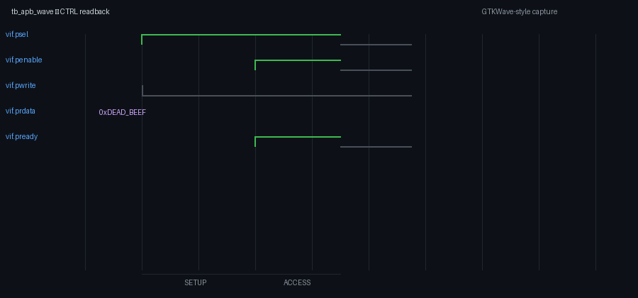
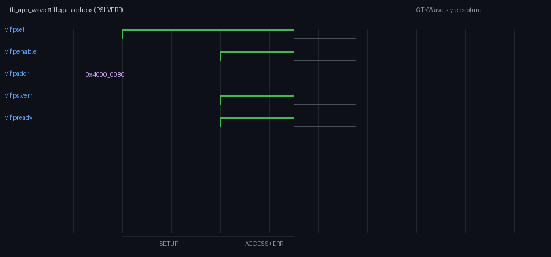

# Verification Results

Latest regression artifacts are checked in under `reports/`. Re-run to refresh:

```bash
cd sim && make sim
```

## Regression summary


```
APB3 Slave Regression Report
=============================
Tests: ALL PASSED
Scoreboard errors: 0
Protocol violations: 0
Functional coverage: 100.0% (goal >= 95%)
Overall: PASS
```

Full log: [`reports/regression_report.txt`](../reports/regression_report.txt)

## Functional coverage

| Bin group | Bins | Hit |
|-----------|------|-----|
| Register access (reg[0:19]) | 20 | 20/20 |
| Read transaction | 1 | 1 |
| Write transaction | 1 | 1 |
| Error path (SLVERR) | 1 | 1 |
| Reset path | 1 | 1 |
| **Total** | **24** | **24/24 (100%)** |

Full report: [`reports/coverage_summary.txt`](../reports/coverage_summary.txt)

## Assertion summary

| Checker | Simulator | Result |
|---------|-----------|--------|
| `apb_protocol_checker` | Verilator | 0 violations |
| `apb_assertions.sv` | Questa / Xcelium | Run with `-f filelist.f + apb_assertions.sv` |

## Waveforms

### GTKWave captures (`tb_apb_wave`)

Run `cd sim && make wave`, then open `reports/wave/apb_wave.gtkw`.

| Write CTRL | Read CTRL | SLVERR |
|------------|-----------|--------|
|  |  |  |

FST artifact: [`reports/wave/apb_wave.fst`](../reports/wave/apb_wave.fst) (2.2 KB — from `make wave`)

### Timing diagrams (portfolio)

| Write | Read |
|-------|------|
|  |  |

| SLVERR | Wait states |
|--------|-------------|
|  |  |

Regenerate assets: `python docs/images/generate_assets.py`

### GTKWave (optional, from FST trace)

```bash
cd sim
make wave
gtkwave obj_dir/Vtb_apb_slave.fst &
```

## Simulation log excerpt

See [`reports/sim.log`](../reports/sim.log) for full console output.
